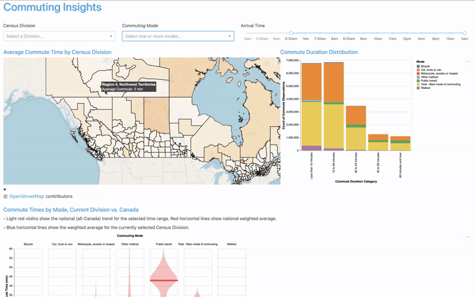

# Commuting Insights

Welcome to **Commuting Insights**! This project aims to provide actionable insights to help shape Canada’s future transportation policies. By analyzing the relationship between commuting patterns and environmental impacts, we aim to assist the Canadian federal government in improving transportation efficiency, reducing CO2 emissions, and enhancing residents' quality of life.

The dashboard visualizes various aspects of commuting behavior across Canada, including transportation modes, average commute times, and regional dependencies on specific means of transport. The ultimate goal is to inform policies that can lead to better, more sustainable commuting solutions across the country.

---

## 🚗 **For Dashboard Users**

### Motivation & Problem Solving

Transportation is a critical factor in urban planning and policy development. In Canada, commuting times are increasing, and the environmental footprint of transportation is rising. **Commuting Insights** helps address these issues by visualizing patterns of commute times, modes of transport, and their relationship to environmental impact across different regions. 

By using this dashboard, you'll be able to explore:

- **Regional Commute Times:** Discover how long people are commuting in different parts of Canada.
- **Modes of Transportation:** See which modes of transport (e.g., cars, public transit, bicycles) are most commonly used in various regions.
- **Environmental Impact:** Analyze how commuting habits are contributing to CO2 emissions and identify areas where improvements can be made.

The dashboard features:

- **Average Commute Time by Census Division:** View the average commute time for different regions across Canada, allowing you to compare data at the regional level.

- **Commute Duration Distribution:** Visualize the count of commute observations categorized by duration (e.g., less than 15 minutes, 15 to 29 minutes, etc.), providing insights into how long Canadians are spending commuting at different times of the day.

- **Commute Times by Mode, Current Division vs. Canada:** Compare commute times for different modes of transportation (e.g., cars, bicycles, public transit) in a selected census division versus the national averages. This feature helps identify unique regional trends and challenges.

This tool can be incredibly useful for policymakers, urban planners, and individuals interested in understanding the state of transportation across Canada.

**[View the live dashboard here](https://dsci-532-2025-28-commuting-insights.onrender.com/)**

To spark your interest, here’s a short demo of the dashboard in action:  


### Need Help?

If you encounter any issues or have questions, please feel free to open an issue in the GitHub repository. We're happy to assist!

---
## 🛠️ **For Developers and Contributors**

Thank you for considering contributing to **Commuting Insights**! We welcome contributions that help improve the project, whether by adding new features, improving documentation, or fixing bugs. Below is a guide to help you get started if you’d like to run the dashboard locally or contribute to the project.

### Prerequisites

To run the app locally, you'll need to set up your environment with the required dependencies.

### Environment Setup

1. Clone this repository:

    ```bash
    git clone https://github.com/UBC-MDS/DSCI-532_2025_28_commuting-insights
    ```

2. Navigate to the project directory:

    ```bash
    cd commuting-insights
    ```

3. Create a conda environment based on the provided `environment.yml` file:

    ```bash
    conda env create --file environment.yml
    ```

4. Once created, activate the environment:

    ```bash
    conda activate commuting_insights
    ```

### Running the Dashboard Locally

1. After activating the environment, navigate to the `/src` folder:

    ```bash
    cd src
    ```

2. Run the dashboard:

    ```bash
    python app.py
    ```


3. Open your browser and paste the URL that appears in the terminal (it will typically start with `http://127.0.0.1:...`).

### Contributing to the Project
We welcome contributions from anyone interested in improving the dashboard. If you would like to help us build features, fix bugs, or improve documentation, please take a look at the contributing guidelines.
- **[Contributing Guidelines](CONTRIBUTING.md)**

### Issues & Pull Requests

If you encounter any issues while using the dashboard or have an idea for a new feature, feel free to open an issue or submit a pull request. Please make sure to follow the contributing guidelines and include relevant information for your proposed changes.

---

## 📄 **License**

Commuting Insights is licensed under the MIT license. See the LICENSE file for more details.

---

## 👨‍💻 **Contributors**

- Eugene You
- Han Wang
- Derek Rodgers
- Francisco Ramirez


---

## 🔗 **References**
Statistics Canada. Table 98-10-0503-01  Commuting duration by main mode of commuting and time arriving at work: Canada, provinces and territories, census divisions and census subdivisions of work DOI: https://doi.org/10.25318/9810050301-eng
