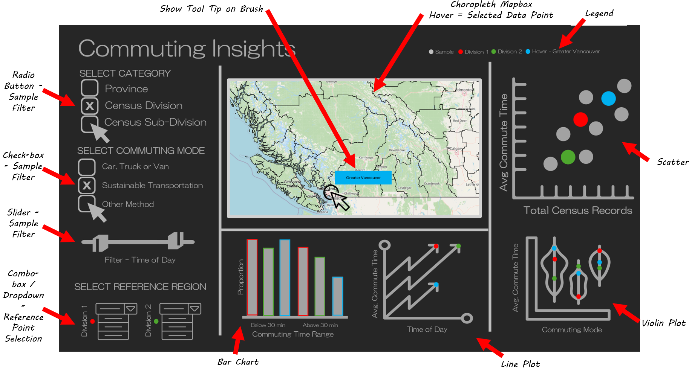

# COMMUTING INSIGHTS

Author Names:

Derek Rodgers  
Eugene You  
Han Wang  
Francisco Ramirez

## Motivation and purpose

The Canadian federal government is facing a critical challenge in addressing the growing concerns about transportation efficiency, environmental impact, and the quality of life for residents. One of the most pressing issues is the high dependency on cars for commuting, which not only leads to longer commute times but also contributes significantly to elevated CO2 emissions. This, in turn, exacerbates climate change, with widespread social, economic, and environmental consequences. As urbanization continues to spread across the country, understanding commuting patterns on a national scale has become essential for developing effective policies.

The purpose of this project is to assist the Canadian federal government by providing a comprehensive comparison of commuting patterns across all regions of Canada. This analysis will focus on the relationship between car dependency and commute times, aiming to identify trends that can inform national transportation policies. By examining the proportion of commutes made by car and the average commute times across the country, the project seeks to highlight regions where car dependency is particularly high, which may contribute to longer commute times and higher environmental impacts.

Through this comparison, the project will provide insights into how different regions across Canada are performing in terms of transportation efficiency and sustainability. This information will support the development of policies and infrastructure investments that aim to reduce car dependency, mitigate CO2 emissions, and improve overall commuting efficiency, benefiting residents nationwide.

## Description of the data

## Research questions and usage scenarios

## App sketch & brief description

The Commuting Insights dashboard is comprised of a main view that is divided into four main sections. 

The section on the left-hand side is focused on sample selection, where the data will be filtered to be segregated by Canadian province or by Census Division, and to be filtered by the commuting mode of interest (using a checkbox) and the time of day of the commute (using a slider). These filters will create the sample that will be present in the accompanying data visualizations. Additionally, two dropdown widgets will be available to select specific data points from the selected sample that could be used as reference and would be highlighted in the visualizations.

The top-middle section will be the main interface for the user to select a region of interest, where a map with subdivisions by province or census divisions will be displayed. Hovering/clicking on the map will define the region of interest that will be displayed as an additional data series in the visualizations. Hovering over the map will also display selected region information through a tooltip.

The bottom-middle section will display plots focused on the reference and the selected/hovered region points, comparing the proportion of commutes over and under 30 minutes, as well as comparing the average commute time for the reference and selected regions at different times of the day using a line plot.

Finally, on the right-hand side, plots including the entire selected sample will offer insight regarding where the reference and selected regions land in the context of the entire sample. These visualizationw will provide insight into how the amount of commutes in the region affect commute time, as well as how different commute times compare between commute modes.