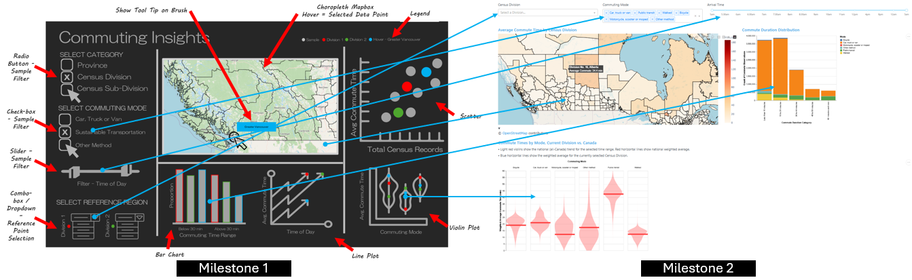

## Reflection

This dashboard is designed to assist the Canadian government by analyzing commuting patterns, focusing on transportation modes and commute times. It aims to identify trends that can inform national policies.

The image below displays the original *Commuting Insights* sketch proposal and its status at the time of Milestone 2 delivery.

### Implemented Features

- Choropleth map focused on `Census Division` in Canada, colored by `Average Commute Time`.
- Drop-down filter to select `Census Division` of interest in Canada.
- Drop-down filter to select one or multiple commuting modes to define the data sample.
- Slider to filter sample based on `Arrival Time`.
- Violin plot for `Average Commute Time` vs selected `Commuting Mode`. Plot displays weighted means for the sample and the selected `Census Division`.
- Bar plot for `Count of Commute Observations` vs `Commute Duration Category`.

### Missing Features

- Scatter plot for `Average Commute Time` vs `Total Commute Observations`
- Line plot for `Average Commute Time` by `Time of Day`.
- Styling features have not been developed.

### Changes to proposal

- The radio button for selecting the type of regional division was removed, focusing only on `Census Division`. Divisions by `Province` and `Census Sub-Divisions` were excluded due to poor quality of `Census Sub-divisions` data for proper choropleth display.
- The dropdown widgets for selecting individual `census regions` were replaced with a single dropdown for selecting the `census region` of interest.
- The bar chart displaying the proportion of commute counts by `Commute Duration Category` was updated to a stacked version showing different `Commute Modes`.
- The layout has been restructured: the sample selection section at the top, the choropleth map on the middle left, and descriptive visualizations on the bottom and right.

These changes have minimal impact on the app's intended purpose while reducing code complexity and visual clutter.

### Issues

- While the app deployment is fully functional, it experiences performance issues on the `render.com` platform, causing slower display times. Code optimization is planned for future iterations.
- The choropleth map reads average commute times directly from the dataset, while other charts calculate a weighted average based on the number of observations. This discrepancy will be addressed in future iterations.
- The browser title bar currently displays only "Dash" and should reflect the app’s name

### Best Practice Deviations 

- Outlier management in the data sample makes plots difficult to interpret, as the visualization areas are consumed by outliers. This issue is being addressed for future iterations.

### Summary

- Strengths: The app is responsive both locally and in `render.com`, aligns with expectations, and follows best practices. It has a well-structured layout.
- Limitations: While the app performs well locally, responsiveness is slow on Render.
- Limitations: Additional features compromise rendering process. Code optimization is necessary to scale the app.
- Future Improvement: The scatter plot could display `Commuting Density` on the x-axis instead of `Total Commute Observations`. Since `area` data is not available to calculate `Commuting Density`, the improvement would involve finding and incorporating it into the dataset.
- Future Improvement: The app could be improved by recovering geographical categorization by `Province` to align to the availability of commute data.