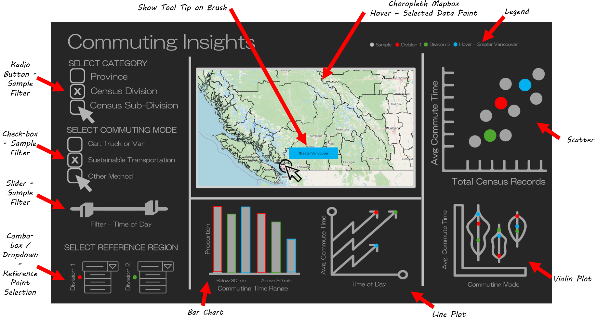
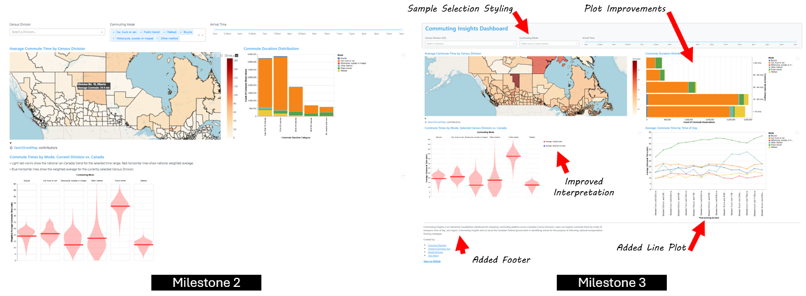

## Reflection

This dashboard is designed to assist the Canadian government by analyzing commuting patterns, focusing on transportation modes and commute times. It aims to identify trends that can inform national policies.

The following image displays the original proposal from Milestone 1: 

The image below displays the state of the *Commuting Insights Dashboard* at the time of delivery of Milestone 3 relative to the Milestone 2 delivery.

### Implemented Features

In response to major instructor feedback:
- Line plot for `Average Commute Time` vs `Time Arriving at Work`. 
- Addition of styling features such as using cards to contain widgets to define sample, adding padding to dashboard.

In response to minor instructor feedback:
- Discrepancies between displayed `Average Commute Time` and `Weighted Average Commute Time` have been resolved. "Weighted" labels have been removed.
- Significant updates to bar plot:
  - Removal of "Total" category
  - Switched axis for improved readability.
- Significant updates to violin plots:
  - Added legends.
  - Removal of descriptive text.
- Slider widget constrained to main dashboard space.
- Layout issues causing chart overlap have been fixed. This includes added padding between charts.
- Updated preprocessing of dataset for improved performance and removal of unused examples.
- Browser title bar displaying dashboard's name. 
- Addition of footer with dashboard description and relevant links.

### Missing Features

- There are no missing features from plan.

### Changes to proposal

- Scatter plot for `Average Commute Time` vs `Total Commute Observations`, while it was present in the original sketch and in the missing features of Milestone 2, has been removed from plan given its redundancy with the information contained in other plots.

These changes have minimal impact on the app's intended purpose while reducing code complexity and visual clutter.

### Issues

- While the dashboard deployment is fully functional, it experiences performance issues on the `render.com` platform, causing slower display times.
- The X-Axis on line plot does not filter based on slider widget.
- Color scale on choroplet is based on filtered sample and should be fixed to be based on full dataset range.

### Best Practice Deviations 

- The X-Axis labels on line plot could be improved for readability. 

### Summary

- Strengths: The completed dashboard aligns with expectations, follows best practices and has a well-structured layout.
- Strengths: Improved data preprocessing enabled consistently successful rendering of the dashboard.
- Limitations: While the app is functional running locally and on Render, responsiveness is slow on Render and update times are long.
- Future Improvement: The scatter plot could display `Commuting Density` on the x-axis instead of `Total Commute Observations`. Since `area` data is not available to calculate `Commuting Density`, the improvement would involve finding and incorporating it into the dataset.
- Future Improvement: The app could be improved by recovering geographical categorization by `Province` to align to the availability of commute data.