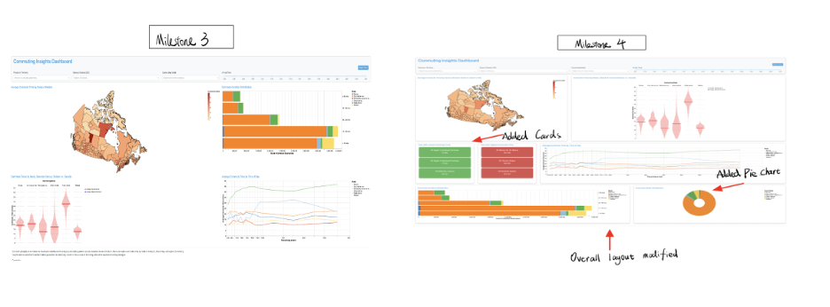

## Reflection

This dashboard is designed to assist the Canadian government by analyzing commuting patterns, focusing on transportation modes and commute times. It aims to identify trends that can inform national policies.

The following image displays the original proposal from Milestone 1: 

The image below displays the state of the *Commuting Insights Dashboard* at the time of delivery of Milestone 4 relative to the Milestone 3 delivery.

### Implemented Features

In response to major instructor feedback:

- Performance improvement: We made significant optimizations to improve the performance when selecting a Census Division (CD) on the map. This was essential to enhance the user experience.
- Data filtering: Redundant filtering and mutating of the data were removed, streamlining the data processing steps.
- Fixed color scale: The color scale in the choropleth map was adjusted to span the entire range of the data, ensuring consistency across the map.
- Performance improvements: We made additional performance improvements, including client-side Flask caching, which improved rendering speeds.
- Binary dataset: We switched from using a CSV to a binary dataset format to enhance loading times and reduce file size.
- Environment update: Updated the environment to add new dependencies introduced during the development process.
- Responsive violin plot: Efforts were made to make the violin plot responsive in width, though it still requires additional adjustments to handle resizing seamlessly.

In response to minor instructor feedback:

- Summary stats section: Consideration was given to adding a summary statistics section at the top, though this was ultimately not implemented.
- Layout improvements: Dropdowns were resized for better visibility, and we experimented with putting all charts inside cards to improve layout clarity. However, encapsulating charts inside cards didn't look as good as expected.
- Chart refinements:
  - The grey color for "unavailable" data was fixed to indicate the correct meaning, and we decided not to show the blue bar for unavailable data.
  - The edge case where the blue bar was at 0 (indicating zero commute time) was resolved, ensuring that no commute time can be zero.
  - The bar chart's title was changed to "Commute Length Distribution," and the Y-axis label was removed.
  - Instances of "(min)" were replaced with "(mins)" for clarity, indicating minutes.
  - The "reset" button for filters was added for better user interaction.
  - The "action" button was removed from Altair charts, improving their clarity.
  - The X-axis time labels on the line chart were shortened for better readability.
  - The color scheme in the bar chart was improved to enhance contrast.
- Map and tooltip updates: The map tooltip was updated to display "Census Division," and the Province Dropdown was renamed to "Province / Territory."
- Final updates: We updated the "Last Updated" date at the bottom of the page, set debug=False for deployment, and added a favicon to improve the branding of the dashboard.

### Missing Features

There are no missing features from the original plan.

### Changes to proposal

- While the scatter plot for Average Commute Time vs Total Commute Observations was initially part of the plan, it was removed in Milestone 3 due to redundancy with other plots. This change streamlined the dashboard and reduced visual clutter.

### Issues

- Despite the functional deployment of the dashboard, we faced some performance issues on the render.com platform, which led to slower display times. We also encountered challenges with making the violin plot responsive, but we adjusted its size for smaller screens and ensured it reflows earlier on screen resize, which mitigated clipping problems with the line chart.

### Best Practice Deviations 

No significant deviations from best practices were identified.

### Summary

- Strengths: The dashboard now performs well with improved data preprocessing and rendering speeds. The layout is more user-friendly, and we addressed several performance issues.
- Limitations: While the app works well locally, the performance on Render is slower, and some responsiveness issues still need to be addressed.
- Future Improvements: We could further refine the violin plot's responsiveness and explore ways to improve the performance of the app on cloud platforms. Additionally, there may be opportunities to enhance the geographical categorization and add further data filters.
